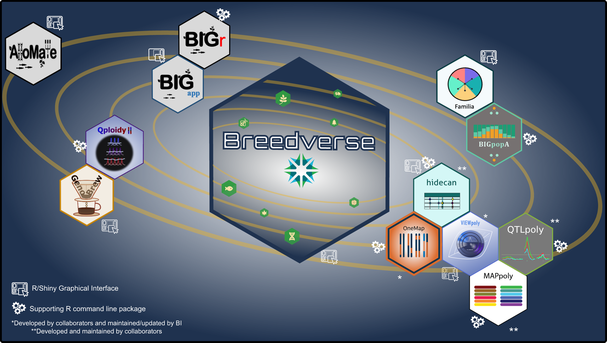

# Breedverse

<!-- badges: start -->
[](https://github.com/Breeding-Insight/Breedverse)
[](https://github.com/Breeding-Insight/Breedverse/blob/main/LICENSE)
[](https://github.com/Breeding-Insight/Breedverse/actions/workflows/R-CMD-check.yaml)

<!-- badges: end -->

**Breedverse** is a modular R Shiny application developed by [Breeding Insight](https://www.breedinginsight.org) at University of Florida (UF/IFAS). It serves as a unified hub that lets users install and launch specialized breeding analysis tools — all from a single interface, with no command-line setup required.



## Overview

Breedverse itself is a lightweight launcher. After installing it, users can install any combination of analysis modules directly from within the app. Each module unlocks a dedicated section in the sidebar with its own set of analysis tools.


---

## Installation

Install Breedverse from GitHub using `remotes`:

```r
# install.packages("remotes")
remotes::install_github("Breeding-Insight/Breedverse")
```

Then launch the app:

```r
Breedverse::run_app()
```

---

## Modules

Modules are installed from within the app via the **Install Modules** page. Each module is sourced from GitHub and loaded dynamically. A restart of the app is required after installation to activate the new features.


### BIGapp — Genotype Processing, Population Genomics, GWAS and GS

> GitHub: [`Breeding-Insight/BIGapp`](https://github.com/Breeding-Insight/BIGapp)  
> CRAN: [`BIGr`](https://CRAN.R-project.org/package=BIGr)  
> Tutorial: [BIGAPP-TUTORIAL](https://scribehow.com/o/s3XiD180SPiAYCOQwB8QDw/page/BIGapp_Tutorials__FdLsY9ZxQsi6kgT9p-U2Zg)

| Category | Feature |
|---|---|
| Genotype Processing | Convert dosage files to VCF |
| Dosage Calling | Off-target SNP calling with updog |
| Filtering | VCF quality filtering |
| Summary Metrics | Genomic diversity statistics |
| Population Structure | PCA, DAPC |
| GWAS | Genome-Wide Association Studies |
| Genomic Selection | GS model fitting and prediction |

---

### Familia — Ancestry Estimation

> GitHub: [`Breeding-Insight/familia`](https://github.com/Breeding-Insight/familia)  
> CRAN: [`BIGpopA`](https://CRAN.R-project.org/package=BIGpopA)  

| Mode | Feature |
|---|---|
| Unsupervised | SNMF — ADMIXTURE-like ancestry proportions |
| Supervised | PolyBreedTools — reference-panel-based ancestry assignment |
| Ploidy Support | Compatible with diploid and polyploid species |

---

### AlloMate — Optimized Mating Plans

> GitHub: [`Breeding-Insight/AlloMate`](https://github.com/Breeding-Insight/AlloMate)  

| Feature | Description |
|---|---|
| Relatedness | Evaluate genetic relatedness among breeding candidates |
| Multi-trait Index | Combine EBVs across traits using user-defined weights |
| OCS | Optimum Contribution Selection to maximize genetic gain |
| Mating Plans | Generate feasible mating lists under kinship constraints |

---

### GenoBrew — Interactive Marker Panel Evaluation and CNV Visualization

> GitHub: [`Breeding-Insight/GenoBrew`](https://github.com/Breeding-Insight/GenoBrew)  
> Tutorial: [GENOBREW-TUTORIAL](https://scribehow.com/o/s3XiD180SPiAYCOQwB8QDw/viewer/GenoBrew_Interactive_Marker_Panel_Evaluation_CNV_Visualization_and_Curation__4uWloBuPT1WlnCvW2UWiTg)

| Feature | Description |
|---|---|
| Marker Panel Tests | Test marker panel performance with historical data |
| Interactive filters | Markers basic filters |
| CNV profiles | Interactive visualization of Qploidy2 CNV profiles results |
| CNV hotspots | Find copy number variation hostspots in the genome |

---

### VIEWpoly — Polyploid QTL and Linkage Map Visualization

> GitHub: [`Breeding-Insight/viewpoly`](https://github.com/Breeding-Insight/viewpoly)  
> CRAN: [`viewpoly`](https://CRAN.R-project.org/package=viewpoly)  
> Tutorial: [VIEWPOLY-TUTORIAL](https://cristianetaniguti.github.io/viewpoly_vignettes/VIEWpoly_tutorial.html)

| Feature | Description |
|---|---|
| Multi-tool Integration | Works with polymapR, MAPpoly, OneMap, polyqtlR, QTLpoly, diaQTL, GWASpoly, HIDECAN |
| QTL Visualization | Interactive QTL profile and effect plots |
| Genome Browser | JBrowseR integration for genome-level exploration |
| Breeding Value Analysis | Visualize marker effects and breeding values |
| Genetic Map Exploration | Interactive linkage group maps |

---

## Requirements

- R ≥ 4.1.0
- Internet connection for module installation (modules are pulled from GitHub)

---

## About Breeding Insight

- Website: https://www.breedinginsight.org
- Contact: https://breedinginsight.org/contact-us/


